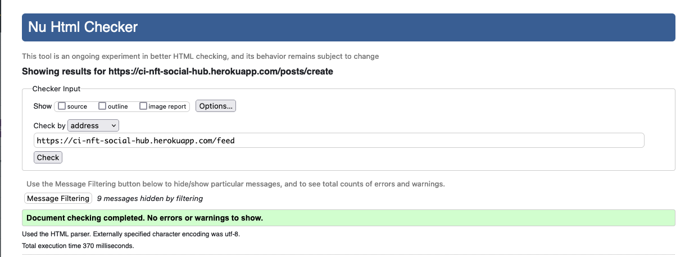
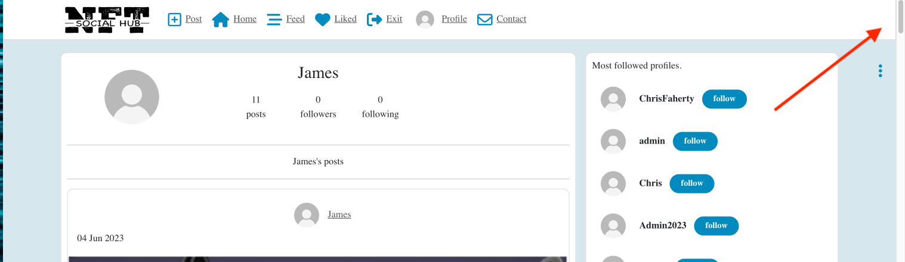
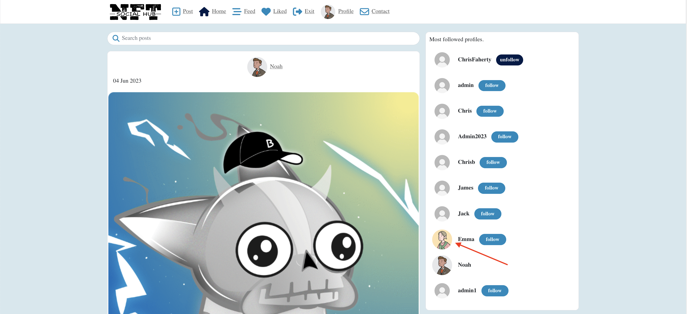
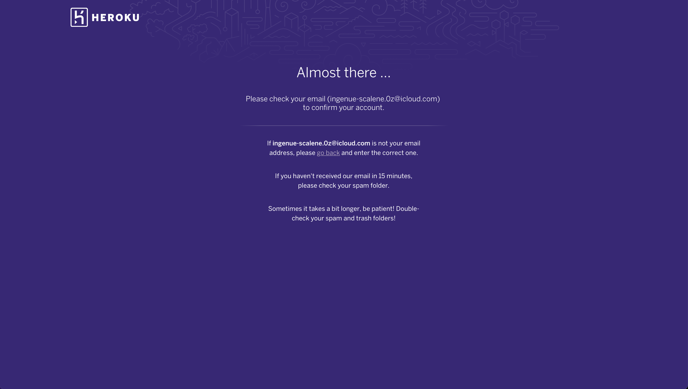
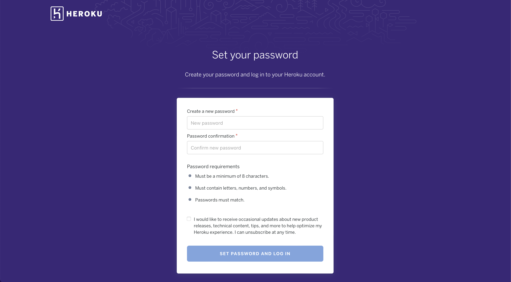

<h1 align="center">The NFT Social Hub - Project Portfolio 5</h1>
 


## - By Christopher Faherty

### [View Live Website](https://ci-nft-social-hub.herokuapp.com/)


## Table of Contents

- [About](#about)
- [Project Goals](#project-goals)
- [User Stories](#user-stories)
- [Design Choices](#design-choices)
  - [Colour Scheme](#colour-scheme)
  - [Fonts](#fonts)
  - [Wireframes](#wireframes)
- [Technologies Used](#technologies-used)
  - [Languages](#languages)
  - [Libraries, frameworks and dependencies](#libraries-frameworks-and-dependencies)
  - [Tools & Programs](#tools--programs)
- [Front-End](#front-end)
- [Back-End API](#back-end-api)
- [Features](#application-features-and-screenshots)
- [Future features / improvements](#future-features--improvements)
- [Validation](#validation)
- [Testing](#testing)
  - [Manual testing of user stories](#manual-testing-of-user-stories)
  - [Performing tests on various devices](#performing-tests)
  - [Browser compatibility](#browers-that-ive-tested-on)
- [Bugs](#bugs)
- [Configuring of App](#configuring-this-app)
- [Credits](#credits)

## About

The NFT Social Hub is place where current or future NFT holders no matter what type of NFT can join and shire information about their project. Users that create an account will be able to post, like, comment and follow other users to keep track of projects they are interested in.
This Hub is for all holders to share their thoughts and collaborate with each other.

## Project Goals

The goal of this project was to create a hub where NFT holders can join and share their projects and collaborate with each other. There is currently no site like this out there specific to NFTs where it is focused on the project and allowing users to find potential future projects they would like to follow.

Required functions that the social hub required:

1. Good user experience and a clear understanding of the user flow,
2. User engagement (posting, liking, disliking, commenting, following, subscribing),
3. User login authentication status,
4. Full CRUD functionality for posts, comments, likes, followers and profile data,
5. Profiles that could be personalised (images, bio),
6. Filtering posts by search functionality of data related to a post (title, user),
7. Like filtering by viewing all previously liked posts,
8. Feed filtering by viewing all followed user's posts,
9. Responsive site for desktop and mobile.

## User Stories

#### Navigation & Authentication (Project Goal # Covered: 1, 3, 8, 9)

1. As a user I can view a navbar from every page so that I can navigate easily between pages,
2. As a user I can navigate through pages quickly so that I can view content seamlessly without page refresh,
3. As a user I can create a new account so that I can access all the features for signed up users,
4. As a user I can sign in to the app so that I can access functionality for logged in users,
5. As a user I can tell if I am logged in or not so that I can log in if I need to,
6. As a user I can maintain my logged-in status until I choose to log out so that my user experience is not compromised,
7. As a logged out user I can see sign in and sign up options so that I can sign in/sign up,
8. As a user I can view user's avatars so that I can easily identify users of the application,

#### Posts (Project Goal # Covered:1, 2, 4, 6, 9 )

9. As a logged in user I can create posts to share my NFT projects with other users. 
10. As a user I can view the details of a single post so that I can learn more about it,
11. As a user I can like a post so that I can show my support for the posts that interest me,
12. As a user I can view all the most recent posts, ordered by most recently created first so that I am up to date with the newest content,
13. As a user I can search for posts with keywords, so that I can find the posts and user profiles I am most interested in,
14. As a user I can view the posts I liked so that I can find the posts I enjoy the most,
15. As a user I can view content filtered by users I follow so that I can keep up to date with what they are posting about,
16. As a user I can keep scrolling through the images on the site, that are loaded for me automatically so that I don't have to click on "next page" etc,

#### Post Detail Page (Project Goal # Covered: 1, 4, 7, 9 )

17. As a user I can view the posts page so that I can read the comments about the post,
18. As a user I can edit my post title and description so that I can make corrections or update my post after it was created,
19. As a user I can add comments to a post so that I can share my thoughts about the post,
20. As a user I can see how long ago a comment was made so that I know how old a comment is,
21. As a user I can read comments on posts so that I can read what other users think about the posts,
22. As a user I can delete my comment so that I can control removal of my comment from the application,
23. As a user I can edit my comment so that I can fix or update my existing comment,
24. As a user I can like or dislike a post but not both together on the same post,

#### Profile Page (Project Goal # Covered: 1, 4, 5, 9  )

25. As a user I can view other users profiles so that I can see their posts and learn more about them,
26. As a user I can see a list of the most followed profiles so that I can see which profiles are popular,
27. As a user I can view statistics about a specific user: bio, number of posts, follows and users followed so that I can learn more about them,
28. As a user I can follow and unfollow other users so that I can see and remove posts by specific users in my posts feed,
29. As a user I can view all the posts by a specific user so that I can catch up on their latest posts, or decide I want to follow them,
30. As a user I can edit my profile so that I can change my profile picture and bio,
31. As a user I can update my username and password so that I can change my display name and keep my profile secure

#### User Experience (Project Goal # Covered: 1, 2 )

32. As a site owner I want my site to flow smoothly so users can navigate it with out any issues,
33. As a site owner I want the user to be able to subscribe to my mailing list so I can reach out to them whenever I have any new features being released,
34. As a user I can view a no results found error page so that I know the page I am on has no content,
35. As a user I can send a message to the admin if i need assistance with any feature,

[Back to Table Of Contents](#table-of-contents)

## Design Choices

### Colour Scheme

For the color scheme I was trying to go with a minimalistic style with different shades of blue. This made the project easy on the eye but also helped guide the users eye to the components that they were able to interact with. 

The color scheme used was created on Coolors


### Fonts

The fonts used for this project were from Google Fonts. It was Source Serif Pro as it worked well with the project logo and and the theme of the project.

### Wireframes

- [Balsamiq Wireframes](https://balsamiq.com/) was used to generate the wirreframes for this project. Wireframes for both mobile and desktop views were created.

The Post, liked & Feed wireframes are the same. They will vary as different users like and follow different accounts.

- Home Page logged in Wireframe - [View](docs/readme/wireframe/home-page-logged-in-wireframe.png)

- Home Page logged out Wireframe - [View](docs/readme/wireframe/home-page-logged-out-wireframe.png)

- Post Wireframe - [View](docs/readme/wireframe/post-wireframe.png)

- Profile Wireframe - [View](docs/readme/wireframe/profile-wireframe.png)

- Feed Wireframe - [View](docs/readme/wireframe/feed-wireframe.png)

- Liked Wireframe - [View](docs/readme/wireframe/liked-wireframe.png)

- Sign in Wireframe - [View](docs/readme/wireframe/sign-in-wireframe.png)

- Sign up Wireframe - [View](docs/readme/wireframe/sign-up-wireframe.png)

- Contact Wireframe - [View](docs/readme/wireframe/contact-wireframe.png)

- Subscribe Wireframe - [View](docs/readme/wireframe/subscribe-wireframe.png)

- No Results Wireframe - [View](docs/readme/wireframe/no-result-wireframe.png)

## Technologies Used

### Languages

- React
- Javascript
- HTML
- CSS

### Libraries, frameworks and dependencies

- [Axios](https://axios-http.com/docs/intro) - Axios was used for promise-based HTTP requests. Justification: Axios was required to send and retrieve data from the User preventing Cross-origin resource sharing errors from occuring.
- [JWT](https://jwt.io/) - JWT library was used to decode JSON Web tokens. Justification: JWT is used to prevent unauthenticated users from making network requests to refresh their access token. This allowed for authentication tokens to be used in the browser to keep logged in users logged in until they logged out.
- [React 17](https://17.reactjs.org/) - JavaScript library for building user interfaces. Justification: This allowed for multiple encapsulated components to be used that manage their own state. React is extremely useful for this reason, and it also updates the data when data changes.
- [React-Bootstrap 1.6.3](https://react-bootstrap-v4.netlify.app/) - React bootstrap allowed for the rapid design of the website. Justification: Bootstrap allowe for a faster build time whilst making the project responsive and styled at the same time.
- [React Router](https://v5.reactrouter.com/web/guides/quick-start) - This was used for dynamic routing. Justification: This this allowed the users to be directed to specific pages via url routers.
- [React Infinite Scroll](https://www.npmjs.com/package/react-infinite-scroll-component) - React Infinite Scroll is a feature used to keep the user engaged Justification: This feature alows the user to continue scrolling and the posts will keep loading.

### Tools & Programs

- [Amiresponsive](https://ui.dev/amiresponsivecom/) was used to create the readme cover image,
- [Balsamiq](https://balsamiq.com/) used to create wireframes,
- [Cloudinary](https://cloudinary.com/) used to store static files,
- [Coolors](https://coolors.co/?home) used to generate the color scheme palette,
- [Favicon](https://favicon.com) used to create the website's favicon,
- [Chrome Developer Tools](https://developers.google.com/web/tools/chrome-devtools/) used for debugging of the code and checking site for responsiveness,
- [Google Fonts](https://fonts.google.com/) - Used for the fonts in the website,
- [GitHub](https://github.com/) used as a remote repository to store project code,
- [Git](https://git-scm.com/) used to commit and push my repository changes to github
- [Font Awesome](https://fontawesome.com/) - used for the icons in the website,
- [React Spinners](https://www.npmjs.com/package/react-spinners) - used to generate the loading spinners
- [Gitpod](https://www.gitpod.io/) - Was my chosen workspace to code this project
- [Heroku](https://dashboard.heroku.com/apps) was used to deploy my code live
- [ESLint](https://eslint.org/) used to validate JSX code
- [WC3 Validator](https://validator.w3.org/) was used to validate my HTML
- [Lighthouse Tools](https://developers.google.com/web/tools/lighthouse/) used to validate performance, accessibility, best practices and SEO of my website
- [Jigsaw W3 Validator](https://jigsaw.w3.org/css-validator/) was used to validate my CSS

## Front-End

### React

React is a popular and widely-used JavaScript library for building user interfaces. Developed by Facebook, React allows developers to create reusable UI components and manage the state of those components, making it easy to build complex, dynamic, and interactive web applications. React utilizes a virtual DOM, which allows for efficient updates and rendering of components, resulting in fast and responsive applications. With a large and active community, a vast ecosystem of supporting tools and libraries, and a focus on declarative and component-based programming, React has become one of the most popular choices for building modern web applications.

React was used to build this application for the following reasons:

1. Reusability: React's component-based architecture makes it easy to reuse code, allowing you to save time and effort when building your application.

2. Performance: React's use of a virtual DOM allows for fast and efficient updates and rendering of components, resulting in a highly performant user interface.

3. Large and Active Community: React has a large and active community, with a vast ecosystem of supporting tools and libraries, which makes it easier to find solutions to problems and stay up-to-date on the latest developments.

4. Declarative Programming: React allows for declarative programming, which makes it easier to understand and reason about your code, and reduces the likelihood of bugs and errors.

5. Scalability: React is highly scalable, making it well-suited for applications of all sizes, from small, simple projects to large, complex applications.

I was able to use varios components in React throughout this project. 

Reuseability fo components was key to help the pace od constructing the project. 

- `<Asset />` - Theasset component changed the asset displayed depending on the props provided These props were:

  - a loading spinner was diosplayed while loading the content from the database
  - an image with a src attribute
  - a message rendered in a paragraph tag

- `<Avatar />` - This component allowed the loged in users avatar to be displayed in different locations (Profiles, posts and comments). The avatar would display beside the users posts and comments while they are logged out as well. 

- `<DropdownMenu />` - A reusable component that renders the dropdown menu- allowing a user to edit or remove their own content. This can be seen on many pages, for example the post page (own post editing), profile page (editing own profile data) and comments editing.

- `<NavBar />` - A reusable component that is rendered on every page. The content within the navbar changes depending on the authentication status of a user (if not logged in, display icons for login/signup). When a user is logged in, they are shown the avatar component and a dropdown menu allowing them to logout or access their profile.

- `<HomePage />` - A unique component that renders the homepage for users that are not logged in, displaying login/signup buttons for a user.

- `<NotFound />` - A unique component that renders the page not found image and message if a 404 error is hit. The navbar is still available on this page so the user can revert to the home page. 

[Back to Table Of Contents](#table-of-contents)

## Back-End API

### Django REST Framework

The backend API for this Front-End application was built with the Django REST Framework. Details about my backend repository can be viewed [here](https://github.com/Chrisfaherty/ci-nft-social-hub-api)

# Application Features and Screenshots

### Home Page (Logged Out)

- An overview of of the current posts users have created,
- NavBar links to Enter(Login), Join(Signup) and and also to subscribe to hear about new features,
- Users can also view the most followed profiles.

<details><summary>Homepage Screenshot</summary>

</details>

### NavBar

- The Navbar can be found on every page,
- If the user is logged out the following is displayed on the navbar "Home", "Enter", "Join", "Subscribe" Buttons
- If the user is logged in - following is displayed "Post", "Home", "Feed", "Liked", "Exit", "Profile" and "Contact" Buttons.
- "NFT Social hub" logo is always displayed.
- On mobile screens the navbar links are added to a hamburger menur to allow for more space on the Navbar.

<details><summary>NavBar Screenshot</summary>


</details>

### Sign Up Form

- Allows new users to create an account,
- The user must provide a valid username (not taken), password and confirm password,
- Usernames are unique and two with the same name cannot be created,
- User is redirected to login page once the signup form is submitted and the username and password is accepted,

<details><summary>Sign Up Form Screenshot</summary>

</details>

### Sign In Form

- Previous users with created accounts can use this form to log in,
- The account must be valid,
- The password must match what was initially created with the username,
- Error messages are be displayed if the details don't match,
- The logged in user is then redirected to the homepage,sign-in-form-feature

<details><summary>Sign In Form Screenshot</summary>

</details>

### Post Creation and Edit Form

- This form is where you input the post image and can fill out the details (Title, category, ect),
- Images and posts can be created and added to your feed to share your NFT's,
- The same form is used for editing a post but the details are prepopulated so you can easly see what you would like to change,

<details><summary>Post Creation and Edit Screenshot</summary>

</details>

### Posts, Feed, Liked Page

- The post, feed and liked pages are visually the same. They just vary depending on the user their likes and follows,
- The post page is the same as the home page it displays all user posts assorted by creation date,
- The liked page, will display all pages the user liked,
- The feed page, Will display all posts by the users you follow,
- Search bar can be used to specify content seen.post-feed-like-page-feature,
- Loggedin users can also see the most followed profiles and decide to follow or unfollow them with the follow/unfollow button,
- The search bar can be used to serch for users posts or posts with specific key words in them.

<details><summary>Post, Feed and Liked Feature Screenshot</summary>

</details>

### Post Page

- This contains specific details tied to a single post (title, image, content, website links, ect),
- This page contains:
  - Number of likes and like button for user like functionality,
  - Number of dislikes and dislike button for the users dislike functionality,
  - Number of comments and comment button to allow the user to comment,
  - Comment section to display all comments on a post.

<details><summary>Post Detail Feature Screenshot</summary>

</details>

### Comments Section

- This allows users to leave comments on a post,
- This page contains the comments and date/user who created the comment.

<details><summary>Comment Feature Screenshot</summary>

</details>

### Profile Page

- Contains user profile information,
- The users profile picture is shown here, it is assigned a place holder but can use the dropdown to edit the picture,
- Shows how many posts the user has created, followers and following,
- Contains a dropdown menu to edit the profile and change profile password over in the right hand corner (3 dots),
- If a user has added a bio, this is displayed here,
- The users posts are also displayed here.

<details><summary>Profile Page Feature Screenshot</summary>

</details>

### User Edit Profile, Password Form

- The user can use this form to edit details in their profile and also change their username and password.

<details><summary>Edit Profile & Password Feature Screenshot</summary>

</details>

### Not Found Page

- If a URL that doesn't exist is entered, this page is displayed to give visual feedback to the user that it is incorrect
- The navbar is still displayed so the user can revert back to the home page.

<details><summary>Not Found Feature Screenshot</summary>

</details>

[Back to Table Of Contents](#table-of-contents)

## Future features & improvements

Improvements I would like to add to my site in the future:

- Authentication
  - Allow account creation and signup using different social media platform accounts (Google, Facebook etc.)
  - Allow login with users metamast (Eth wallets)
  - Password reset feature for the user if they forget theirs
- Posts
  - Connecting the avatar and post images to the specific IPFS storage location of the image,
- Profile
  - Profiles to be connected to soulbound tokens so that is your login in the future
- Comments
  - Comment liking
- Subscription & Contact
    - I would like to have email feedback to the sender when these forms submit in the future.
- App rework for ios and mobile display bugs
  - Ability to authenticate the user on mobile

## Validation

### HTML

I used the W3C Markup Validation Service to validate my HTML code. As you can see, no errors were found within my HTML.

<details><summary>Home page (Logged Out)</summary> 
 
</details> 
<details><summary>Signin Page</summary> 
 
</details> 
<details><summary>Sign Up Page</summary> 
 
</details> 
<details><summary>Feed Page</summary> 
 
</details> 
<details><summary>Liked Posts Page</summary> 
 
</details> 
<details><summary>Create Post Page</summary> 
 
</details> 
<details><summary>Edit Post Page</summary> 
 
</details> 
<details><summary>Profiles Page</summary> 
 
</details> 
<details><summary>Edit Profile Page</summary> 
 
</details> 
<details><summary>Edit Password Page</summary> 
 
</details> 
<details><summary>Edit Username Page</summary> 
 
</details>
</details> 
<details><summary>Post ID Page</summary> 
 
</details> 
</details> 
<details><summary>Subscribe Page</summary> 
 
</details>
</details> 
<details><summary>Contact Page</summary> 
 
</details> 
<details><summary>Not Found Page</summary> 
 
</details>

[Back to Table Of Contents](#table-of-contents)

### CSS

I used the W3C Jigsaw CSS Validation Service to validate the CSS of my website. All of my CSS modules that were imported within my js files were validated. No errors were found in the CSS, The same pass image was used for all below.

<details><summary>App.module.css</summary> 
 
</details>

<details><summary>Index.css</summary> 
 
</details>

<details><summary>Asset.module.css</summary> 
 
</details>

<details><summary>Avatar.module.css</summary> 
 
</details>

<details><summary>Button.module.css</summary> 
 
</details>

<details><summary>Comment.module.css</summary> 
 
</details>

<details><summary>CommentCreateEditForm.module.css</summary> 
 
</details>

<details><summary>MoreDropdown.module.css</summary> 
 
</details>

<details><summary>NavBar.module.css</summary> 
 
</details>

<details><summary>NotFound.module.css</summary> 
 
</details>

<details><summary>Post.module.css</summary> 
 
</details>

<details><summary>PostCreateEditForm.module.css</summary> 
 
</details>

<details><summary>PostsPage.module.css</summary> 
 
</details>

<details><summary>Profile.module.css</summary> 
 
</details>

<details><summary>ProfilePage.module.css</summary> 
 
</details>

<details><summary>SignInUpForm.module.css</summary> 
 
</details>

<details><summary>Profile.module.css</summary> 
 
</details>

<details><summary>SubscriptionConfirmation.module.css</summary> 
 
</details>

[Back to Table Of Contents](#table-of-contents)

### Lighthouse Report

Lighthouse was used to test the performance, accessibility, best practice and SEO of the site. The validation was done for both desktop & mobile.

<details><summary>Desktop</summary> 
 
</details>

<details><summary>Mobile</summary> 
 
</details>

### JSX

ESLint was installed initially when the project was created and has been running as the project was being developed. 
There were no JSX errors and the project compiled sucessfully.

<details><summary>Eslint validation for all files</summary> 
 
</details>


## Testing

### Manual testing of user stories

1. As a user I can view a navbar from every page so that I can navigate easily between pages,

| **Action**                                     | **Expected Result**                                                                                                           | **Actual Result** |
| ---------------------------------------------- | ----------------------------------------------------------------------------------------------------------------------------- | ----------------- |
| Go to https://ci-nft-social-hub.herokuapp.com/ | Home Page when logged out shows the Navbar and its functions                                                                  | Works as expected |
| Go to the Join button in the Navbar            | This takes you to the signup page where you create your login details and when you create them it takes you to the login form | Works as expected |
| Login to your account                          | This will bring you to the logged in home page where you have different items in your navbar                                  | Works as expected |

<details><summary>User Story Test Screenshot</summary>


</details>

2.  As a user I can navigate through pages quickly so that I can view content seamlessly without page refresh,

| **Action**                                           | **Expected Result**                                 | **Actual Result** |
| ---------------------------------------------------- | --------------------------------------------------- | ----------------- |
| In the posts page scroll down past 10 posts and the new posts keep loading | The infinity scroll activates after 10 posts to keep loading the scroll bar at the side of the page reduces in size| Works as expected |

<details><summary>User Story Test Screenshot</summary>



</details>

3.  As a user I can create a new account so that I can access all the features for signed up users

| **Action**                                                   | **Expected Result**                                             | **Actual Result** |
| ------------------------------------------------------------ | --------------------------------------------------------------- | ----------------- |
| View login and signup buttons to create an account or log in | Navbar shows different login/signup links to logged out users | Works as expected |

<details><summary>User Story Test Screenshot</summary>

</details>

4.  As a user I can sign in to the app so that I can access functionality for logged in users

| **Action**                       | **Expected Result**                                                          | **Actual Result** |
| -------------------------------- | ---------------------------------------------------------------------------- | ----------------- |
| Create an account in signup form | Site allows me to create an account using the signup form and sign in afterwards | Works as expected |

<details><summary>User Story Test Screenshot</summary>


</details>

5.  As a user I can tell if I am logged in or not so that I can log in if I need to,

| **Action**                          | **Expected Result**                                                     | **Actual Result** |
| ----------------------------------- | ----------------------------------------------------------------------- | ----------------- |
| The Navbar will display Enter if your logged in or Exit if your logged out | Logged in user sees Exit on navbar | Works as expected |

<details><summary>User Story Test Screenshots</summary>

</details>

6.  As a user I can maintain my logged-in status until I choose to log out so that my user experience is not compromised,

| **Action**                                                                     | **Expected Result**                                                        | **Actual Result** |
| ------------------------------------------------------------------------------ | -------------------------------------------------------------------------- | ----------------- |
| Login and check the nav bar to see if your logged in | Exit is displayed on the navbar showing the user is logged in | Works as expected |
| Hard refresh the page and check if the user is still logged in | Exit is displayed on the navbar showing the user is still logged in | Works as expected |

<details><summary>User Story Test Screenshots</summary>


</details>

7.  As a logged out user I can see sign in and sign up options so that I can sign in/sign up,

| **Action**                                               | **Expected Result**                                                                         | **Actual Result** |
| -------------------------------------------------------- | ------------------------------------------------------------------------------------------- | ----------------- |
| Go to the home page and check the navbar to see if it says Enter or Exit | the navbar will display enter and join for logged out users | Works as expected |

<details><summary>User Story Test Screenshots</summary>

</details>

8.  As a user I can view user's avatars so that I can easily identify users of the application,

| **Action**                                        | **Expected Result**                                                     | **Actual Result** |
| ------------------------------------------------- | ----------------------------------------------------------------------- | ----------------- |
| Log in to your account and check for Avatars beside users posts | Avatars should be displayed beside a users username in their posts | Works as expected |

<details><summary>User Story Test Screenshots</summary>

</details>

9.  As a logged in user I can create posts to share my NFT projects with other users.

| **Action**                              | **Expected Result**                         | **Actual Result** |
| --------------------------------------- | ------------------------------------------- | ----------------- |
| Click on the post link in the nav bar   | This will bring you to the create post page | Works as expected |
| Fill in the post details & click create | This will bring you to the post page        | Works as expected |

<details><summary>User Story Test Screenshots</summary>


</details>

10. As a user I can view the details of a single post so that I can learn more about it,

| **Action**                                                             | **Expected Result**                                                                          | **Actual Result** |
| ---------------------------------------------------------------------- | -------------------------------------------------------------------------------------------- | ----------------- |
| Click on the post image of the post you want to see more details about | If I click a profile image, it should take me to a user's profile containing all their posts | Works as expected |

<details><summary>User Story Test Screenshots</summary>


</details>

11. As a user I can like a post so that I can show my support for the posts that interest me,

| **Action**                                                      | **Expected Result**                                      | **Actual Result** |
| --------------------------------------------------------------- | -------------------------------------------------------- | ----------------- |
| Underneath any post you can click on the heart to like the post | The heart will change color and update the count to by 1 | Works as expected |

<details><summary>User Story Test Screenshots</summary>


</details>

12. As a user I can view all the most recent posts, ordered by most recently created first so that I am up to date with the newest content,

| **Action**                                                               | **Expected Result**                                               | **Actual Result** |
| ------------------------------------------------------------------------ | ----------------------------------------------------------------- | ----------------- |
| Navigate to the home page and the first post displayed is the latest one | The first post displayed will be the latest post that was created | Works as expected |

<details><summary>User Story Test Screenshots</summary>

</details>

13. As a user I can search for posts with keywords, so that I can find the posts and user profiles I am most interested in,

| **Action**                                                                      | **Expected Result**                                                              | **Actual Result** |
| ------------------------------------------------------------------------------- | -------------------------------------------------------------------------------- | ----------------- |
| Navigate to the home page and you will find the search bar above the first post | Type in details about what you are looking for and it should find a related post | Works as expected |

<details><summary>User Story Test Screenshots</summary>


</details>

14. As a user I can view the posts I liked so that I can find the posts I enjoy the most

| **Action**                            | **Expected Result**                          | **Actual Result** |
| ------------------------------------- | -------------------------------------------- | ----------------- |
| In the navbar clink on the Liked link | All posts the user liked should be displayed | Works as expected |

<details><summary>User Story Test Screenshots</summary>


</details>

15. As a user I can view content filtered by users I follow so that I can keep up to date with what they are posting about,

| **Action**                                                                                      | **Expected Result**                                      | **Actual Result** |
| ----------------------------------------------------------------------------------------------- | -------------------------------------------------------- | ----------------- |
| In the home page on the right hand side click on the follow button for users you want to follow | The user will be followed and button changes to unfollow | Works as expected |
| Click on Feed in the navbar                                                                     | The posts displayed will be from users you follow        | Works as expected |

<details><summary>User Story Test Screenshots</summary>


</details>

16. As a user I can keep scrolling through the images on the site, thay are loaded for me automatically so that I don't have to click on "next page" etc,

| **Action**                                    | **Expected Result**                                     | **Actual Result** |
| --------------------------------------------- | ------------------------------------------------------- | ----------------- |
| Navigate to the home page and start scrolling | The posts will keep being added until there are no more | Works as expected |

<details><summary>User Story Test Screenshots</summary>

</details>

17. As a user I can view the posts page so that I can read the comments about the post,

| **Action**                                                                               | **Expected Result**                                 | **Actual Result** |
| ---------------------------------------------------------------------------------------- | --------------------------------------------------- | ----------------- |
| Click on the post you want to viwe comments for then scroll down to the comments section | The latest comment will be displayed under the post | Works as expected |

<details><summary>User Story Test Screenshots</summary>


</details>

18. As a user I can edit my post title and description so that I can make corrections or update my post after it was created,

| **Action**                                                  | **Expected Result**                              | **Actual Result** |
| ----------------------------------------------------------- | ------------------------------------------------ | ----------------- |
| Click on the post you want to edit                          | This will bring the user to the post detail page | Works as expected |
| Click on the 3 dots in the top left hand corner of the post | This will open the dropdown menu                 | Works as expected |
| Click on the edit icon                                      | This will open up the edit page                  | Works as expected |
| Enter the details and click save                            | This will save the net details in the post       | Works as expected |

<details><summary>User Story Test Screenshots</summary>


</details>

19. As a user I can add comments to a post so that I can share my thoughts about the post,

| **Action**                                                                                            | **Expected Result**                                                          | **Actual Result** |
| ----------------------------------------------------------------------------------------------------- | ---------------------------------------------------------------------------- | ----------------- |
| click on the post you want to comment on then scroll down to the comments section and leave a comment | The comment is added to the post and will be on top as it is the most recent | Works as expected |

<details><summary>User Story Test Screenshots</summary>


</details>

20. As a user I can see how long ago a comment was made so that I know how old a comment is,

| **Action**                                                                  | **Expected Result**                                    | **Actual Result** |
| --------------------------------------------------------------------------- | ------------------------------------------------------ | ----------------- |
| Click on the post and scroll down to the comments it will have a date on it | There is a date beside the avatar of the comment owner | Works as expected |

<details><summary>User Story Test Screenshots</summary>

</details>

21. As a user I can read comments on posts so that I can read what other users think about the posts,

| **Action**                                                                                                 | **Expected Result**                                                        | **Actual Result** |
| ---------------------------------------------------------------------------------------------------------- | -------------------------------------------------------------------------- | ----------------- |
| Click on the comments icon below the post you want to read the comments about, scroll down to the comments | The user is brought to the posts page where the comments are at the bottom | Works as expected |

<details><summary>User Story Test Screenshots</summary>


</details>

22. As a user I can delete my comment so that I can control removal of my comment from the application,

| **Action**                                               | **Expected Result**                                     | **Actual Result** |
| -------------------------------------------------------- | ------------------------------------------------------- | ----------------- |
| Click on the 3 dots under the comment you want to delete | The drop down menu opens with the edit and delete icons | Works as expected |
| Click on the delete icon                                 | The comment is deleted                                  | Works as expected |

<details><summary>User Story Test Screenshots</summary>


</details>

23. As a user I can edit my comment so that I can fix or update my existing comment,

| **Action**                                                           | **Expected Result**                                 | **Actual Result** |
| -------------------------------------------------------------------- | --------------------------------------------------- | ----------------- |
| Click on the 3 dots underneath the comment you want to edit          | the dropdown will display the edit and delete icons | Works as expected |
| Click on the edit button, enter in the edited comment and click save | The comment is edited and posted                    | Works as expected |

<details><summary>User Story Test Screenshots</summary>


</details>

24. As a user I can like or dislike a post but not both together on the same post,

| **Action**                                                        | **Expected Result**                                                               | **Actual Result** |
| ----------------------------------------------------------------- | --------------------------------------------------------------------------------- | ----------------- |
| Click on the dislike button on a post that you have already liked | An error message will be displayed saying you cant like and dislike the same post | Works as expected |

<details><summary>User Story Test Screenshots</summary>

</details>

25. As a user I can view other users profiles so that I can see their posts and learn more about them,

| **Action**                                      | **Expected Result**                                            | **Actual Result** |
| ----------------------------------------------- | -------------------------------------------------------------- | ----------------- |
| On the right hand side on the home page click on any profile you would like yo view | The user is brought to the users profile | Works as expected |

<details><summary>User Story Test Screenshots</summary>



</details>

26. As a user I can see a list of the most followed profiles so that I can see which profiles are popular,

| **Action**                                    | **Expected Result**                                                             | **Actual Result** |
| --------------------------------------------- | ------------------------------------------------------------------------------- | ----------------- |
| On the right hand side of the home page you can see the most popular profiles | A list of the most popular profiles are displayed | Works as expected |

<details><summary>User Story Test Screenshots</summary>

</details>

27. As a user I can view statistics about a specific user: bio, number of posts, follows and users followed so that I can learn more about them,

| **Action**                                      | **Expected Result**                                          | **Actual Result** |
| ----------------------------------------------- | ------------------------------------------------------------ | ----------------- |
| Click on any users avitar and you will see the stats in their profile | the user is taken to the other users profile and the stats are displayed | Works as expected |

<details><summary>User Story Test Screenshots</summary>


</details>

28. As a user I can follow and unfollow other users so that I can see and remove posts by specific users in my posts feed,

| **Action**                            | **Expected Result**                                       | **Actual Result** |
| ------------------------------------- | --------------------------------------------------------- | ----------------- |
| On the home page in the most populat profiles you are able to follow and unfollow users | If you click follow it will change the button to unfollow | Works as expected |

<details><summary>User Story Test Screenshots</summary>


</details>

29. As a user I can view all the posts by a specific user so that I can catch up on their latest posts, or decide I want to follow them,

| **Action**                                  | **Expected Result**                 | **Actual Result** |
| ------------------------------------------- | ----------------------------------- | ----------------- |
| Click on the avatar of the user you want to check out | the user is brought to their profile where they can see all their posts | Works as expected |

<details><summary>User Story Test Screenshots</summary>


</details>

30. As a user I can edit my profile so that I can change my profile picture and bio,

| **Action**                                                       | **Expected Result**                                                                                            | **Actual Result** |
| ---------------------------------------------------------------- | -------------------------------------------------------------------------------------------------------------- | ----------------- |
| On your profile page click on the 3 dots in the top right hand corner under the nav bar | Opens up a drop down list | Works as expected |
| Click on edit profile and then once you change the details click save | Opens up the edit profile page | Works as expected |

<details><summary>User Story Test Screenshots</summary>


</details>

31. As a user I can update my username and password so that I can change my display name and keep my profile secure

| **Action**        | **Expected Result**                                                              | **Actual Result** |
| ----------------- | -------------------------------------------------------------------------------- | ----------------- |
| On your profile page click on the 3 dots in the top right hand corner under the nav bar | Opens up a drop down list | Works as expected |
| Click on edit user name or password and then once you change the details click save | Opens up the edit user name or edit password page | Works as expected |

<details><summary>User Story Test Screenshots</summary>


</details>


32. As a site owner I want my site to flow smoothly so users can navigate it with out any issues,

| **Action**                                                     | **Expected Result**                                                      | **Actual Result** |
| -------------------------------------------------------------- | ------------------------------------------------------------------------ | ----------------- |
| View all the links on the navbar for both logged in and logged out users | The user can move about the site smoothly | Works as expected |

<details><summary>User Story Test Screenshots</summary>


</details>

33. As a site owner I want the user to be able to subscribe to my mailing list so I can reach out to them whenever I have any new features being released,

| **Action**                                               | **Expected Result**                                                                   | **Actual Result** |
| -------------------------------------------------------- | ------------------------------------------------------------------------------------- | ----------------- |
| in the navbar click on the suscribe line, then input your information and click submit | the user navigates to the subscribe page and submits their details and a confirmation page is displayed | Works as expected |

<details><summary>User Story Test Screenshots</summary>


</details>

34. As a user I can view a no results found error page so that I know the page I am on has no content,

| **Action**                                                                    | **Expected Result**                                                                  | **Actual Result** |
| ----------------------------------------------------------------------------- | ------------------------------------------------------------------------------------ | ----------------- |
| The user visits a url that is not valid for the site | A no results found page will be displayed | Works as expected |

<details><summary>User Story Test Screenshots</summary>

</details>

35. As a user I can send a message to the admin if i need assistance with any feature,

| **Action**                   | **Expected Result**                                                      | **Actual Result** |
| ---------------------------- | ------------------------------------------------------------------------ | ----------------- |
| click on contact in the logged in navbar, then submit your details | The user will be brought to a confirmation message | Works as expected |

<details><summary>User Story Test Screenshots</summary>


</details>

[Back to Table Of Contents](#table-of-contents)

### Performing Tests

I built and tested this website using Google Chrome Developer tools- which allowed me to test specific breakpoints for different screen sizes.

I tested this website using:

For desktop and mobile responsiveness.

### Browers that I've tested on

Testing has been carried out on the following browsers:


Therefor this project should be tested on Chrome or firefox on desktop. 

- Googe Chrome
- Firefox
- IOS

## Bugs

- Browser Compatability

    - I have an issue when i an trying to sign in on IOS, Mobile Browsers and Safari, When logging in i would get redirected back to the log in page.
        I found out that Google Chrome and Firefox on desktop were the only 2 browsers having this issue. The issue seems to be with the access token getting stored which is used to redirect the logged in user to the loged in page. Since the token was not getting stored correctly in local storage the redirect kept pushing me back to the sign in screen. 
        This is a bug that I want to fix when i have more time. The bug is known by many and seems to be a react compatability issue with browsers. 

- Subscription Form

    - I am after getting a bug with my subscription form where it is saying that my fullname in undefine. This bug was not evedent yesterday when i was testing out the project. 
        I have not been able to resolve this due to the tight time copnstraints of submission and at risk of causing more issues. 
        This is a bug i will fix after submission as i get more time to focus on it. The functionality of the rest of the project meets the project criteria therefore I made the decision to keep this bug unresolved.

[Back to Table Of Contents](#table-of-contents)

## Deployment

### Deploying to Heroku
* Go to the heroku.com site.
    <details><summary>Screenshots</summary>
    
    </details>
* Click the signup button in the top right.
    <details><summary>Screenshots</summary>
    
    </details>
* Create an account on heroku.com,
    <details><summary>Screenshots</summary>
    
    </details>
* Confirm your account in the email heroku sent to your inbox,
    <details><summary>Screenshots</summary>
    
    </details>
* Create a password,
    <details><summary>Screenshots</summary>
    
    </details>
* Click and proceed,
    <details><summary>Screenshots</summary>
    
    </details>
* Accept the terms of service,
    <details><summary>Screenshots</summary>
    
    </details>
* Create a new app, create a name for your app "ci_nft_social_hub" and choose your region,
    <details><summary>Screenshots</summary>
    
    </details>
* Go to the settings section,
    <details><summary>Screenshots</summary>
    
    </details>

* In the build packs section click add buildpack. For this project, I added 'node.js'. 

* Go to "Deploy" in "Deployment method" select "GitHub",
    <details><summary>Screenshots</summary>
    
    </details>
* Click 'Search' (Enter in your projects name that you have in your github repositry)and then 'Connect'. This project is connected to Chrisfaherty/ci-nft-social-hub.
    <details><summary>Screenshots</summary>
    
    </details>
* Choose the branch you want to buid your app from "main" .
* If prefered, click on "Enable Automatic Deploys", which keeps the app up to date when you push to git hub. Automatic deployments is turned on for this project.
    <details><summary>Screenshots</summary>
    
    </details>
* If the project doesn't deploy after selecting automatic deploy . In the Manual deploy section click Deploy Branch to deploy your code, this is what I had to do.
    <details><summary>Screenshots</summary>
    
    </details>
* Once the code is deployed it will show a button that you can click to view the deployed site. Then the project has sucessfully been deployed.

* Make sure you have a Procfile with this line of code in it web: serve -s build to configure your dynos.

* An "Open App" button will apear on the top right, click it to open your newly deployed project, Click that and that will bring you to your deployed app.


### Forking the GitHub Repository

By forking the GitHub Repository we make a copy of the original repository on our GitHub account to view and/or make changes without affecting the original repository by using the following steps...

1. Log in to GitHub and locate the [GitHub Repository](https://github.com/chrisfaherty/ci-nft-social-hub)
2. At the top of the Repository (not top of page) just above the "Settings" Button on the menu, locate the "Fork" Button.
3. You should now have a copy of the original repository in your GitHub account.

### Making a Local Clone

1. Log in to GitHub and locate the [GitHub Repository](https://github.com/chrisfaherty/ci-nft-social-hub)
2. Under the repository name, click "Clone or download".
3. To clone the repository using HTTPS, under "Clone with HTTPS", copy the link.
4. Open Git Bash
5. Change the current working directory to the location where you want the cloned directory to be made.
6. Type `git clone`, and then paste the URL you copied in Step 3.

```
$ git clone https://github.com/chrisfaherty/ci-nft-social-hub
```

7. Press Enter. Your local clone will be created.

Click [Here](https://help.github.com/en/github/creating-cloning-and-archiving-repositories/cloning-a-repository#cloning-a-repository-to-github-desktop) to retrieve pictures for some of the buttons and more detailed explanations of the above process.


## Credits
* The Code Institute sections.
    * Buiding with Bootstrap 2 - Used for insperation on the bootstrap code,
    * drf-api - Used for insperation for the backend,
    * moments - Used for insperation for the frontend,


## Acknowledgements
I would like to take the opertunity to thank:
* My Mentor Mo Shami for the great feedback productive meetings and guiding me to finishing this project.
* Niamh Faherty for creating the Logo for this project.
* I would also like to thank the Code institute team for all the support and material to assist with this project.
* The code institute Tutors for being available when ever guidance was required.
* I would like to thank Nick Coles & Chris Browning for the help with problem solving and independant reviews.

[Back to Table Of Contents](#table-of-contents)